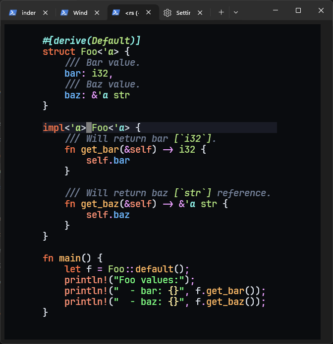
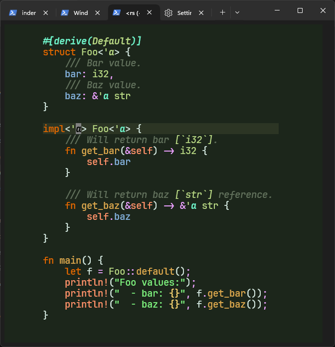
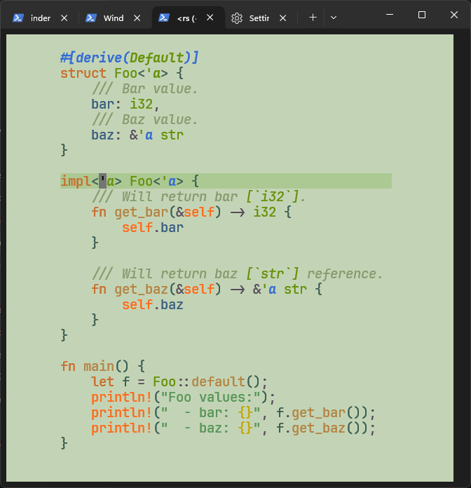

# rustheme.nvim 🦀

A neovim colorscheme based on [Rust Foundation
brand's](https://rustfoundation.org/brand-guide/) color palette:

<table>
  <tr>
    <th>core dark</th>
    <th>core light</th>
  </tr>
  <tr>
    <td></td>
    <td></td>
  </tr>
  <tr>
    <th>mangrove dark</th>
    <th>mangrove light</th>
  </tr>
  <tr>
    <td></td>
    <td></td>
  </tr>
</table>

> [!NOTE]
>
> - The color's name/hex was taken from the official website. They
>   can change over time...
> - The colorscheme aren't the same as the colors reference. This is
>   intended to achieve a better view contrast and code feeling.
